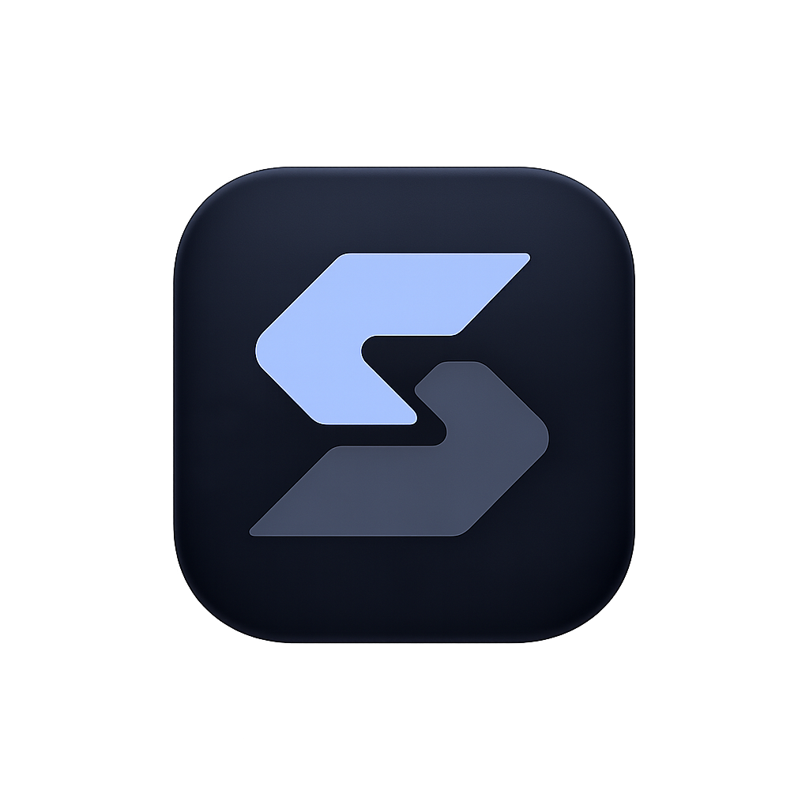

<p align="center">
  
</p>

<h1 align="center">SmartSearch</h1>

<p align="center">
  <strong>Multi-source research dashboard</strong><br />
  Search arXiv, Wikipedia &amp; Cornell — generate citations, bookmark papers.<br />
  No database. No API keys. Runs entirely in the browser.
</p>

<p align="center">
  
  
  
</p>

---

## Features

- **3 search sources** — arXiv (academic papers), Wikipedia (encyclopedia), Cornell (university news)
- **Citation generator** — APA, MLA, Chicago formats with one-click copy
- **Bookmarks** — save papers to localStorage, persists across sessions
- **Search history** — recent queries stored locally, click to re-search
- **Dark glassmorphism UI** — collapsible sidebar, responsive layout
- **Resilient fetching** — automatic throttle (3.5s gap), 429 retry, HTML fallback when the API is slow

## Quick Start

```bash
npm install
npm run dev
```

Open [http://localhost:3000](http://localhost:3000) in your browser.

## Build

```bash
npm run build
```

## Tech Stack

| Layer | Tech |
|-------|------|
| Framework | Next.js 16 (App Router) |
| Language | TypeScript |
| Styling | Tailwind CSS v4 |
| Icons | lucide-react |
| Storage | localStorage (no backend) |

## How It Works

All data is fetched live from public APIs through a Next.js API proxy (`/api/search`). Papers are stored in your browser's localStorage — there is no database, no sign-up, and no server-side persistence.

### Sources

| Source | Endpoint | Method |
|--------|----------|--------|
| **arXiv** | `export.arxiv.org/api/query` | Atom XML → regex parser, 12s timeout, falls back to HTML search page |
| **Wikipedia** | `en.wikipedia.org/api/rest_v1/page/summary/` | REST API with OpenSearch |
| **Cornell** | `news.cornell.edu/search-results` | HTML scraper |

## Project Structure

```
src/
├── app/
│   ├── api/search/     Next.js API proxy for all sources
│   ├── layout.tsx      Root layout with dark theme
│   ├── page.tsx        Main page — state, tabs, sidebar logic
│   └── globals.css     Tailwind theme tokens, glassmorphism, animations
├── components/
│   ├── layout/         Header
│   ├── search/         SearchBar with source selector + filters
│   ├── paper/          PaperCard with portal-based citation dropdown
│   ├── home/           HomeView — landing page
│   ├── insights/       InsightsView — saved papers + history
│   └── citations/      SummaryPanel
├── lib/
│   ├── arxiv.ts        XML parser, throttle, timeout, retry
│   ├── wikipedia.ts    Wikipedia REST API client
│   ├── cornell.ts      Cornell HTML scraper
│   └── citation.ts     APA / MLA / Chicago formatters
└── types/
    └── paper.ts        Paper interface
```

## License

MIT

---

<p align="center">Built by <strong>zakariaelqannaa-dv</strong></p>

